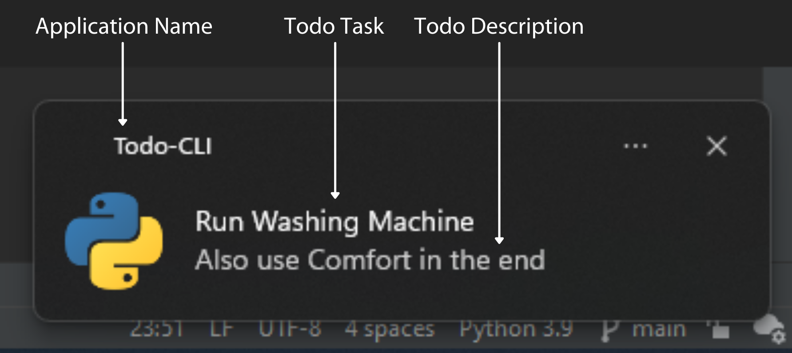
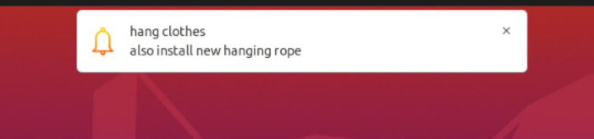
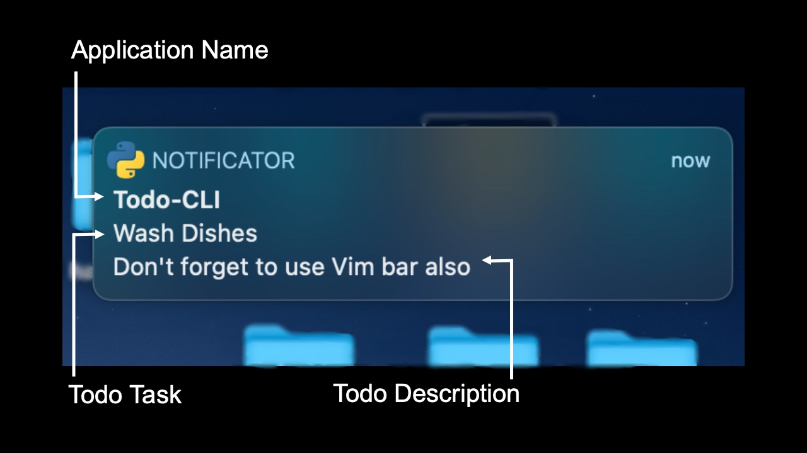

# Todo-CLI

## Features
Full-Fledged Command Line Based Todo List with the following features planned:

- [x] Interactive Interface
- [x] OS Notifications
- [x] Save and Remove Todo
- [ ] Persistent Todo Storage
- [ ] Todo Data Encryption

## To Run the Program
1. Install dependencies
    ```
    pip install -r requirements.txt
    ```
2. Run the Script
   ```
   python Main.py
   ```
## To Use the Program
After following the above steps, you will be prompted to input a command into the command line. Currently, the following commands are available:

### Add:
The 'add' command will add a new task to the todo list. It takes two required arguments - 'Todo Title' and 'Todo Description' - both of which should be enclosed in quotes if more than one word. For example:
```
add Word "This is a multi-word description so needs to be enclosed in quotes"
```
Will add a new todo with:
- A title of 'Word'
- A description matching the quoted section above
- A deadline set to the current default of 1 minute

This brings us to the deadline argument. This optional argument sets a deadline for the todo item. Once this deadline is reached, you will be alerted to it by a notification through your operating system (examples shown below) and a message on the command line.

This deadline can be given in two different formats each with its own flag - if both are given, the --time argument will be used:

- The --offset flag: How long, in minutes, after the task is added you would like to set the deadline for. Decimal values aren't required but they are supported. For example:
```
add "Adding a Deadline with the Offset Flag" "This todo item has a deadline set five and a half minutes from now" --offset 5.5
```

- The --time flag: Will accept entries formatted "dd/mm/YYYY H:M". This sets the deadline for the specified date and time. For example:
```
add "Adding a Deadline with the --time flag" "This todo item will have a deadline of the 1st of Feburary 2022 at 3:30pm" --time "01/02/2022 15:30"
```
Note:
- The argument is in quotes
- There is a space between the date and time portions of the argument
- All values are zero-padded - i.e. February is given as '02' not just '2'
- The 'hour' portion of the time is given as a 24hr value

### View:
The 'view' command will display all of your todo items in the command line. The items will be ordered according to their deadlines with the items whose deadlines are closest to the current time at the top of the list. There are currently no arguments required for this command so simply enter it in to the command line when prompted to do so.
```
view
```

### Exit
To exit the program, which at the moment will result in losing the entirety of your todo list, simply enter the 'exit' command when prompted:
```
exit
```

### --help
Entering an invalid command, or no command at all, will display usage instructions but this can be manually invoked with the --help command.
```
--help
```
To get the usage instructions for one of the commands mentioned above, pass --help as an argument to it. For example, to see how to use the 'add' command enter the following:
```
add --help
```

## Sample Notifications
Notifications will look similar to the following:

### Windows 
   

### Linux 
   

### MacOS 
   

## Maintainers
- [Abhrioop Mukherjee](https://github.com/Abhiroop25902)
- [Rahul Halder](https://github.com/hrahul2605)
- [Arnab Sen](https://github.com/arnabsen1729)

## Contributing

Thank you for your interest in contributing to our repo! Before making any PRs, we strongly suggest you go through our [contribution guidelines](./CONTIRBUTING.md) to see how you can contribute to this project.

## Hacktoberfest 2021


All of the valid PRs made to this repository before the **31st of October** will be labelled with **'hacktoberfest-accepted'**. For more rules visit the [Hacktoberfest Website](https://hacktoberfest.digitalocean.com/resources/participation).

## License

The code in this repo is licensed under the [MIT license](./LICENSE). Feel free to use and share it as per the license.

<hr>

## Who are we?

We are DSC-IIEST. Feel free to [join our community here](https://gdsc.community.dev/indian-institute-of-engineering-science-and-technology-shibpur-howrah-1/).


<a href="https://www.linkedin.com/company/dsc-iiest/"></a>
<a href="https://www.youtube.com/channel/UCkArLcgek88KQMbIu2kmygQ"></a>
<a href="https://twitter.com/dsciiest"></a>
<a href="https://www.facebook.com/dsciiest"></a>
<a href="https://instagram.com/dsciiest"></a>
<a href="https://discord.gg/e2Yc3dt7JM"></a>
